# Architecture

```mermaid
flowchart LR
  MIC[Microphone<br/>PortAudio/WASAPI] --> CAP[AudioCaptureService<br/>callback → queue]
  WAV[WAV file<br/>dev / self-test] --> SEG
  CAP --> RS[StreamResampler<br/>→16 kHz mono f32] --> SEG[SpeechSegmenter<br/>Silero VAD + pre/post-roll<br/>split ≤22 s]
  SEG --> Q[SegmentQueue<br/>RAM-bounded, spills to temp/UUID]
  Q --> W[STTWorker] --> P[TranscriptionProvider<br/>GigaAM-v3 e2e RNNT]
  P --> M[TranscriptMerger<br/>order + overlap dedup]
  M --> X[FactExtractor<br/>LLM, strict JSON]
  X --> V[EvidenceValidator<br/>deterministic]
  V --> C[ConflictResolver]
  C --> F[Formatter<br/>LLM or deterministic]
  F --> FC[FinalFactChecker]
  FC --> D[Doctor review<br/>edit · copy · source]
```

## Layers (`src/mva`)
| Package | Responsibility |
|---|---|
| `core/state_machine.py` | Explicit states: INITIALIZING, MODEL_LOADING, IDLE, RECORDING, STOPPING, FINALIZING_STT, ANALYZING, REVIEW, ERROR. Atomic `try_transition` makes double clicks/hotkey repeats harmless. |
| `audio/` | Capture (PortAudio callback copies blocks only), resampling (soxr), levels and low-signal detection, Silero VAD wrapper and hysteresis, segmenter, ring buffer. |
| `transcription/` | `TranscriptionProvider` interface; `GigaAMTranscriptionProvider`; `FakeTranscriptionProvider` for tests; `ModelManager` (download/resume/verify); queue, worker, merger, `SessionTranscriber` (shared by mic and file input). |
| `clinical/` | Schemas, versioned prompts, extraction, validation, conflict resolution, formatters, final fact check, lexicon. Never imports GigaAM or Qt. |
| `llm/` | `LLMProvider` interface, `OpenAICompatibleProvider` (cloud or local URL), `MockLLMProvider`. |
| `security/` | PHI-redacting logging, OS credential vault. |
| `storage/` | Versioned settings (no PHI, no secrets), per-visit temp dirs with orphan cleanup. |
| `integrations/medialog/` | `MedicalRecordIntegration` boundary; clipboard is the MVP path, `MediLogAdapter` is a placeholder (not exposed). |
| `diagnostics/` | Self-test, health check, PHI-free report, benchmark, STT metrics. |
| `ui/` | `AppController` (only place that wires services; worker threads + Qt signals), main window, settings, onboarding, hotkeys, theme. |

## Threads
UI thread: Qt only. Workers: `model-init`, `audio-pump` (resample + VAD + segmentation), `stt-worker` (GigaAM, one segment at a time → output order equals audio order), `visit-stop`, `analysis` (LLM). PortAudio's own callback thread only copies buffers.

## Model lifetime
GigaAM is loaded once at application start and reused for all visits. «Новый приём» drops audio buffers, transcript, facts and warnings, but keeps the model.

## Long visits
Audio is never processed as one file: VAD segments (target ≤16 s, hard ≤22 s, GigaAM's documented limit is 25 s) are transcribed while the visit is running. When the speaker doesn't pause, the segmenter splits at the quietest frame of the last 5 s; only if there is no pause at all does it make a forced split with 600 ms overlap, which `TranscriptMerger` deduplicates (dedup is applied only to real audio overlap, so genuine repetitions stay).

## Backpressure
At most 24 pending segments are kept in RAM; more are written to `temp/<uuid>/` and deleted right after transcription. Nothing is dropped; the UI warns if STT lags more than 45 s behind speech.
